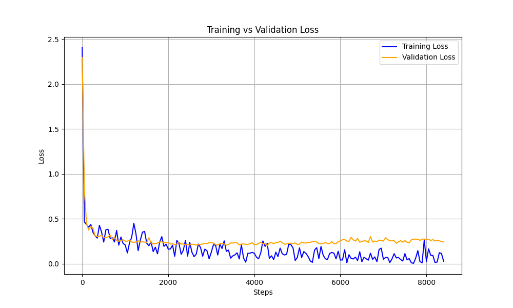

# Fashion MNIST Classification 👗👟

> **From Scratch Neural Network to CNN: A Deep Learning Evolution**

This project demonstrates the power of convolutional neural networks by comparing a **custom-built fully connected neural network** against a **modern CNN architecture** on the Fashion MNIST dataset. Both implementations achieve strong results, with the CNN delivering a significant accuracy boost.

---

## 🎯 Results at a Glance

| Model | Test Accuracy | Test Loss | Architecture |
|:------|:-------------:|:---------:|:-------------|
| **Fully Connected NN** (from scratch) | 87.48% | 0.2177 | 784 → 300 → 100 → 10 |
| **CNN** (PyTorch) | **91.73%** | 0.2783 | Conv2D + BatchNorm + Dropout |

### 📈 Performance Improvement
```diff
+ Accuracy: 87.48% → 91.73% (+4.25%)
```

The CNN model achieves a **4.25% accuracy improvement** over the manually-implemented fully connected network, demonstrating how convolutional layers excel at capturing spatial patterns in image data.

---

## 📉 Training Loss Curve (CNN)



The loss curve shows:
- **Rapid convergence** in the first ~500 steps
- **Stable training** with minimal overfitting (training and validation losses track closely)
- **Final validation loss** settles around ~0.28

---

## 🧠 Model Architectures

### 1. Fully Connected Neural Network (`train.py`)
*Built completely from scratch using only NumPy and SciPy*

```
Input (784) → Hidden1 (300, ReLU) → Hidden2 (100, ReLU) → Output (10, Sigmoid)
```

**Key Features:**
- ✅ Manual forward/backward propagation
- ✅ Hand-coded ReLU derivatives
- ✅ Stochastic Gradient Descent (SGD)
- ✅ No deep learning frameworks

**Highlights:**
- Implements **backpropagation from scratch** using the chain rule
- Uses **ReLU activations** in hidden layers to prevent vanishing gradients
- Achieves **87.48% accuracy** with pure NumPy math

---

### 2. Convolutional Neural Network (`cnn_train.py`)
*Built with PyTorch for GPU-accelerated training*

```
Input (1×28×28)
    ↓
Conv2D (64 filters, 3×3) → ReLU → BatchNorm → MaxPool (2×2) → Dropout (0.1)
    ↓
Conv2D (128 filters, 3×3) → ReLU → BatchNorm → MaxPool (2×2) → Dropout (0.1)
    ↓
Flatten → Linear (4608 → 10)
```

**Key Features:**
- ✅ 2 Convolutional layers with increasing filter depth (64 → 128)
- ✅ Batch Normalization for training stability
- ✅ Dropout regularization (0.1) to prevent overfitting
- ✅ AdamW optimizer with learning rate 3e-4
- ✅ Cross-Entropy loss function
- ✅ MPS/CUDA acceleration support

**Highlights:**
- Achieves **91.73% accuracy** on the test set
- Trains for 10 epochs with 90/10 train-validation split
- Produces stable loss curves with minimal overfitting

---

## 📂 Project Structure

```
fashion-mnist-scratch/
├── train.py                 # From-scratch fully connected NN
├── cnn_train.py             # PyTorch CNN implementation
├── data_preprocessor.py     # Data loading & normalization utilities
├── normal_nn_stats.json     # FC network evaluation results
├── cnn_model_stats.json     # CNN evaluation results
├── training_loss_plot.png   # Loss curve visualization
└── README.md
```

---

## 🚀 Quick Start

### Train the Fully Connected Network
```bash
python train.py
```

### Train the CNN
```bash
python cnn_train.py
```

*Requires Fashion MNIST CSV files (`fashion-mnist_train.csv`, `fashion-mnist_test.csv`) in the project directory.*

---

## 🔬 Why the CNN Wins

| Aspect | Fully Connected NN | CNN |
|--------|-------------------|-----|
| **Spatial Awareness** | Treats pixels independently | Learns local patterns (edges, textures) |
| **Parameter Efficiency** | 784×300 + 300×100 + 100×10 = ~266K params | Shared conv filters = fewer params |
| **Translation Invariance** | ❌ No | ✅ Yes |
| **Feature Hierarchy** | Flat representation | Low→High level features |

Convolutional layers are specifically designed for image data—they understand that neighboring pixels are related, making them far more effective for visual classification tasks.

---

## 📊 Dataset

**Fashion MNIST** consists of 70,000 grayscale images (28×28 pixels) across 10 clothing categories:

| Label | Class |
|:-----:|:------|
| 0 | T-shirt/top |
| 1 | Trouser |
| 2 | Pullover |
| 3 | Dress |
| 4 | Coat |
| 5 | Sandal |
| 6 | Shirt |
| 7 | Sneaker |
| 8 | Bag |
| 9 | Ankle boot |

---

## 🛠️ Dependencies

- **NumPy** & **SciPy** (for from-scratch NN)
- **PyTorch** (for CNN)
- **Matplotlib** (for loss visualization)

---

<p align="center">
  <i>Built to understand neural networks from the ground up 🧪</i>
</p>
